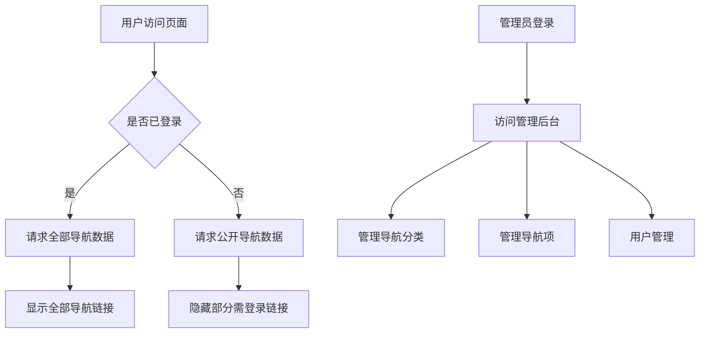

# 导航栏全站项目开发文档

版本：v1.2.0  
最后更新：2025-08-18

---

## 一、项目概述

### 1.1 项目背景

本项目为个人使用的导航栏全站项目，旨在整合常用网站、工具、资源，提升个人效率。页面支持响应式布局，适配PC和移动端。部分导航链接需登录后可见，但大部分内容对未登录用户开放。数据持久化采用 SQLite 数据库，后端提供 API 支持。

### 1.2 技术栈

| 分类     | 技术选型            | 备注                           |
| -------- | ------------------  | ------------------------------ |
| 前端     | Vue2                | 渐进式JavaScript框架           |
| 样式     | Element UI          | 基于Vue的组件库，美观易用      |
| 交互     | Vue + JavaScript    | 组件化开发，响应式数据绑定     |
| 后端     | Python + Flask      | 轻量级Web框架，RESTful API     |
| 数据库   | SQLite              | 轻量级嵌入式数据库，支持层级分类 |
| 部署     | 静态+后端服务       | 前端静态文件+后端API服务       |
| 依赖管理 | pip/venv            | Python虚拟环境管理             |

### 1.3 项目当前状态

- ✅ **数据库设计**：已完成表结构设计，支持三层导航结构
- ✅ **数据模型**：基于data.json的实际数据结构优化
- ✅ **技术选型**：确定使用Flask作为后端框架
- ✅ **前端开发**：已完成响应式布局和交互功能
- ✅ **后端开发**：已完成API接口和数据处理逻辑
- ✅ **接口设计**：已完成RESTful API设计和实现
- ✅ **项目部署**：已完成部署文档和流程设计

---

## 二、开发环境配置

### 2.1 前置依赖

- 工具安装：  
  - Python 3.11+  
  - pip  
  - venv（推荐虚拟环境）  
  - SQLite 3.0+（轻量级数据库）
  - 现代浏览器（如Chrome、Edge、Firefox等）

- 目录结构（实际）：
  ```
  project_root/
    ├─ web/                      # 用户端页面
    │   ├─ index.html            # 用户端主页面
    │   ├─ index.css             # 主样式表
    │   ├─ login.html            # 用户端登录页面
    │   └─ README.md             # 前端说明文档
    ├─ backend/                  # 后端目录
    │   ├─ app.py                # Flask主应用文件
    │   ├─ requirements.txt      # Python依赖列表
    │   ├─ config.py             # 配置文件
    │   ├─ init_db.py            # 数据库初始化脚本
    │   ├─ start.py              # 启动脚本
    │   ├─ test_api.py           # API测试脚本
    │   ├─ models/               # 数据模型目录
    │   │   ├─ __init__.py
    │   │   ├─ user.py           # 用户模型
    │   │   ├─ user_simple.py    # 简化用户模型
    │   │   ├─ category.py       # 分类模型
    │   │   ├─ navigation.py     # 导航项模型
    │   │   └─ navs.py           # 导航项扩展模型
    │   ├─ routes/               # 路由处理目录
    │   │   ├─ __init__.py
    │   │   ├─ auth.py           # 认证相关路由
    │   │   ├─ api.py            # API路由
    │   │   ├─ categories.py     # 分类相关路由
    │   │   └─ navigation.py     # 导航相关路由
    │   ├─ utils/                # 工具函数目录
    │   │   ├─ __init__.py
    │   │   ├─ auth.py           # 认证工具
    │   │   └─ responses.py      # 响应格式化工具
    │   └─ instance/             # 实例文件
    │       └─ app.db            # SQLite数据库文件
    ├─ admin/                    # 管理端页面
    │   ├─ login.html            # 管理员登录页面
    │   ├─ dashboard.html        # 管理仪表盘
    │   ├─ categories.html       # 分类管理页面
    │   └─ navs.html             # 导航项管理页面
    ├─ 项目原型/                 # 原型设计文件
    │   ├─ index.html            # 原型主页
    │   ├─ styles.css            # 原型样式
    │   ├─ script.js             # 原型交互脚本
    │   └─ README.md             # 原型说明
    ├─ 接口提示词/               # API文档和提示词
    │   ├─ 导航分类接口开发完成报告.md
    │   ├─ 导航系统首页API数据对接.md
    │   ├─ 后端-导航菜单表JSON对接文档.md
    │   ├─ 后端-导航分类表JSON对接文档.md
    │   └─ 后端-用户JSON对接文档.md
    ├─ 导航系统数据库设计文档-SQLite.md  # 数据库设计文档
    ├─ 部署文档.md                      # 部署指南
    ├─ 项目进度文档.md                  # 项目进度跟踪
    └─ 项目完成总结.md                  # 项目总结报告
  ```

### 2.2 环境配置步骤

1. **创建项目目录**
   ```bash
   mkdir navigation_project
   cd navigation_project
   ```

2. **创建 Python 虚拟环境**
   
   ```bash
   python -m venv venv
   source venv/bin/activate  # Linux/Mac
   venv\Scripts\activate     # Windows
   ```
   
3. **安装 Python 依赖**
   
   ```bash
   pip install flask flask-sqlalchemy flask-cors flask-jwt-extended
   pip freeze > requirements.txt
   ```
   
4. **初始化 Flask 应用**
   
   ```bash
   # 创建基本目录结构
   mkdir -p backend/models backend/routes backend/utils backend/instance
   
   # 创建数据库文件
   touch backend/instance/app.db
   
   # 运行Flask应用
   cd backend
   python app.py
   ```

### 2.3 启动项目

- 启动 Flask 开发服务器：
  ```bash
  cd backend
  python app.py  # 默认 http://127.0.0.1:5000
  # 或
  python start.py  # 使用启动脚本
  # 或
  flask run --host=0.0.0.0 --port=5000  # 允许外部访问
  ```
- 启动前端：  
  直接用浏览器打开 `web/index.html`。
- 测试API：  
  启动后访问 http://127.0.0.1:5000/api/navs 进行API测试。
- 用户端主页面路径：http://localhost:5000/web/index.html
  用户端的登录页面：http://localhost:5000/web/login.html 
  管理端登录页面：http://localhost:5000/admin/login.html
  管理端主页面路径：http://localhost:5000/admin/dashboard.html            
-    账号：admin               密码：123456                          注意：  用户端和客户端的域名分开绑定                        

---

## 三、代码规范

### 3.1 通用规则

- 文件命名：小写字母+中划线（如 script.js、styles.css）
- 注释：重要逻辑、复杂样式需添加注释说明
- 提交信息：如有版本管理，建议使用简明描述（如 feat: 新增登录功能）

### 3.2 前端规范

- 结构：HTML 结构清晰，语义化标签
- 样式：样式集中在 styles.css，采用BEM风格命名
- 脚本：所有交互逻辑集中在 script.js，函数命名见名知意

### 3.3 后端规范（Flask）

- **应用工厂模式**：使用create_app()创建应用实例
- **蓝图分层**：按功能模块划分蓝图（如auth、api、navigation）
- **REST API**：使用Flask-RESTful或原生路由提供标准化API
- **数据库ORM**：使用Flask-SQLAlchemy进行数据操作
- **配置管理**：使用config.py管理不同环境的配置
- **错误处理**：统一错误处理和响应格式
- **认证授权**：使用Flask-JWT-Extended处理JWT认证

---

## 四、核心功能说明

### 4.1 功能模块清单

| 模块名称     | 依赖接口                | 状态     |
| ------------ | ----------------------- | -------- |
| 登录功能     | POST /api/login         | 已完成   |
| 导航栏       | GET /api/navs           | 已完成   |
| 权限控制     | 前端+后端判断           | 已完成   |
| 分类管理     | GET/POST /api/categories| 已完成   |
| 导航项管理   | GET/POST/PUT/DELETE /api/navs | 已完成 |
| 管理员后台   | 独立页面+API            | 已完成   |

### 4.2 关键逻辑流程图



---

## 五、功能与实现说明

### 5.1 登录功能

- 登录入口：页面右上角或指定区域
- 登录方式：前端表单，后端API校验（用户名/密码）
- 登录后：返回JWT token，前端存储（localStorage/sessionStorage），部分导航链接显示
- 未登录：大部分导航可用，部分链接隐藏或不可点击

### 5.2 权限控制

- 前端：根据登录状态显示/隐藏部分导航
- 后端：API根据JWT token判断权限，返回对应数据
- 登录状态保存在本地（如 localStorage/sessionStorage）
- 管理员权限：特殊角色，可访问管理后台

### 5.3 导航栏

- 支持多级菜单、下拉菜单
- 响应式布局，移动端自动适配
- 数据来源：后端API（SQLite持久化）
- 支持按分类展示、搜索功能

### 5.4 管理后台

- 独立的管理员登录入口
- 分类管理：增删改查导航分类
- 导航项管理：增删改查导航项
- 用户管理：基本的用户权限控制

---

## 六、数据库设计（SQLite）

### 6.1 数据库结构概述

项目采用 SQLite 轻量级嵌入式数据库，支持三层导航结构：大分类 -> 子分类 -> 具体网站。

### 6.2 核心表结构

- **users**：用户表，管理用户登录信息
  ```sql
  CREATE TABLE users (
      id INTEGER PRIMARY KEY AUTOINCREMENT,
      username TEXT NOT NULL UNIQUE,
      password_hash TEXT NOT NULL,
      email TEXT UNIQUE,
      is_admin BOOLEAN DEFAULT 0,
      created_at TIMESTAMP DEFAULT CURRENT_TIMESTAMP
  );
  ```

- **nav_categories**：导航分类表，支持多级分类结构
  ```sql
  CREATE TABLE nav_categories (
      id INTEGER PRIMARY KEY AUTOINCREMENT,
      name TEXT NOT NULL,
      description TEXT,
      parent_id INTEGER,
      is_public BOOLEAN DEFAULT 1,
      sort_order INTEGER DEFAULT 0,
      created_at TIMESTAMP DEFAULT CURRENT_TIMESTAMP,
      FOREIGN KEY (parent_id) REFERENCES nav_categories (id)
  );
  ```

- **navs**：导航项表，存储具体的网站导航信息
  ```sql
  CREATE TABLE navs (
      id INTEGER PRIMARY KEY AUTOINCREMENT,
      title TEXT NOT NULL,
      url TEXT NOT NULL,
      description TEXT,
      icon TEXT,
      category_id INTEGER NOT NULL,
      is_public BOOLEAN DEFAULT 1,
      sort_order INTEGER DEFAULT 0,
      created_at TIMESTAMP DEFAULT CURRENT_TIMESTAMP,
      FOREIGN KEY (category_id) REFERENCES nav_categories (id)
  );
  ```

### 6.3 关键特性

- 支持层级分类：`parent_id` 字段实现父子关系
- 外键约束：确保数据一致性和完整性
- 灵活排序：`sort_order` 字段支持自定义排序
- 权限控制：`is_public` 字段控制内容可见性

### 6.4 详细设计文档

完整的数据库设计请参考：`导航系统数据库设计文档-SQLite.md`
该文档包含：
- 详细的表结构定义
- ER 关系图
- 完整的 SQL 创建脚本
- 数据操作示例
- 数据库优化建议

---

## 七、样式与交互

### 7.1 样式设计

- 所有样式集中在 index.css，支持深色模式和动画
- 采用响应式设计，适配不同屏幕尺寸
- 使用CSS变量定义主题色和关键样式，便于统一修改
- 支持自定义主题和颜色方案

### 7.2 交互功能

- 主要交互（如菜单展开、tab切换、登录状态切换）由原生JavaScript实现
- 支持键盘导航和快捷键
- 实现搜索功能，支持实时过滤导航项
- 兼容主流浏览器，移动端适配良好

### 7.3 性能优化

- 延迟加载非关键资源
- 压缩CSS和JavaScript文件
- 优化图片资源，使用适当的图片格式
- 实现本地缓存，减少不必要的API请求

---

## 八、API 文档

### 8.1 认证接口

- **登录**
  - 路径：`POST /api/login`
  - 请求体：`{ "username": "...", "password": "..." }`
  - 响应：`{ "code": 200, "token": "..." }`
  - 说明：成功登录后返回JWT令牌，用于后续请求认证

- **验证令牌**
  - 路径：`GET /api/verify`
  - 请求头：`Authorization: Bearer <token>`
  - 响应：`{ "code": 200, "message": "Token is valid" }`
  - 说明：验证当前令牌是否有效

### 8.2 导航数据接口

- **获取所有导航分类**
  - 路径：`GET /api/categories`
  - 请求头：`Authorization: Bearer <token>` (可选)
  - 响应：`{ "code": 200, "data": [ ... ] }`
  - 说明：未登录用户只返回公开分类，已登录用户返回全部分类

- **获取导航项**
  - 路径：`GET /api/navs`
  - 参数：`category_id` (可选，按分类筛选)
  - 请求头：`Authorization: Bearer <token>` (可选)
  - 响应：`{ "code": 200, "data": [ ... ] }`
  - 说明：未登录用户只返回公开导航项，已登录用户返回全部导航项

### 8.3 管理接口

- **创建/更新分类**
  - 路径：`POST /api/categories` (创建) / `PUT /api/categories/<id>` (更新)
  - 请求头：`Authorization: Bearer <token>` (必须，需管理员权限)
  - 请求体：`{ "name": "...", "description": "...", "parent_id": null, "is_public": true }`
  - 响应：`{ "code": 200, "message": "Category created/updated successfully" }`

- **创建/更新导航项**
  - 路径：`POST /api/navs` (创建) / `PUT /api/navs/<id>` (更新)
  - 请求头：`Authorization: Bearer <token>` (必须，需管理员权限)
  - 请求体：`{ "title": "...", "url": "...", "description": "...", "category_id": 1, "is_public": true }`
  - 响应：`{ "code": 200, "message": "Navigation item created/updated successfully" }`

- **删除分类/导航项**
  - 路径：`DELETE /api/categories/<id>` / `DELETE /api/navs/<id>`
  - 请求头：`Authorization: Bearer <token>` (必须，需管理员权限)
  - 响应：`{ "code": 200, "message": "Deleted successfully" }`

---

## 九、测试与部署

### 9.1 测试策略

- **后端测试**：
  - 使用pytest进行单元测试和集成测试
  - 测试文件：`test_api.py`, `test_categories.py`, `test_login.py`
  - 覆盖所有API端点和关键业务逻辑
  - 测试覆盖率目标 ≥ 80%

- **前端测试**：
  - 手动测试各功能点
  - 跨浏览器兼容性测试
  - 响应式布局测试（不同设备尺寸）

### 9.2 部署流程

1. **数据库部署**
   - 上传 SQLite 数据库文件（app.db）
   - 或在服务器上执行初始化脚本 `init_db.py`
   - 设置数据库文件权限确保安全访问

2. **后端服务部署（Flask + Gunicorn）**
   - 安装生产依赖：
     ```bash
     pip install gunicorn
     ```
   - 启动生产服务：
     ```bash
     gunicorn app:app --bind 0.0.0.0:5000 --workers=3
     ```
   - 配置Nginx反向代理（推荐）：
     ```nginx
     server {
         listen 80;
         server_name api.yourdomain.com;
         
         location / {
             proxy_pass http://127.0.0.1:5000;
             proxy_set_header Host $host;
             proxy_set_header X-Real-IP $remote_addr;
         }
     }
     ```

3. **前端部署**
   - 静态文件托管（Nginx、Apache 等）
   - 配置 API 接口地址

   **前端文件结构**：
   ```
   web/
     ├─ index.html
     ├─ index.css
     ├─ login.html
     └─ ...
   ```

   **配置 API 地址**：
   在前端JavaScript中修改 API 地址：
   ```javascript
   const API_BASE_URL = 'http://api.yourdomain.com';
   ```

   **Nginx配置示例**：
   ```nginx
   server {
       listen 80;
       server_name nav.yourdomain.com;
       root /path/to/navigation_project/web;
       index index.html;
       
       location / {
           try_files $uri $uri/ /index.html;
       }
   }
   ```

4. **管理后台部署**
   - 与前端类似，部署admin目录下的静态文件
   - 配置管理API接口地址
   - 设置适当的访问控制，限制未授权访问

### 9.3 域名绑定方案

详细的域名绑定方案请参考：`用户端和管理端域名绑定方案.md`

---

## 十、常见问题与解决方案

### 10.1 用户问题

Q：为什么有些导航链接看不到？  
A：部分链接仅在登录后可见，登录后自动显示。

Q：如何添加自定义导航链接？  
A：目前需要管理员在后台添加，未来可能支持用户自定义收藏功能。

Q：忘记密码怎么办？  
A：请联系管理员重置密码。

### 10.2 技术问题

Q：如何扩展登录功能？  
A：可对接第三方登录（如OAuth），或增加注册功能。代码修改主要在 `routes/auth.py` 文件。

Q：如何备份数据库？  
A：SQLite数据库可直接复制文件进行备份，或使用 `.backup` 命令：
```bash
sqlite3 instance/app.db ".backup backup.db"
```

Q：如何添加新的导航分类层级？  
A：当前支持三层结构，如需更多层级，需修改 `models/category.py` 中的递归查询逻辑。

---

## 十一、项目进展与未来计划

### 11.1 当前完成情况

- ✅ 基础架构搭建
- ✅ 数据库设计与实现
- ✅ 用户认证系统
- ✅ 导航数据API
- ✅ 前端页面开发
- ✅ 管理后台开发
- ✅ 部署文档编写

### 11.2 未来计划

- 🔄 用户自定义收藏功能
- 🔄 导航使用统计分析
- 🔄 更丰富的主题定制
- 🔄 移动端专用界面优化
- 🔄 搜索引擎集成

---

## 十二、备注

- 本项目为个人使用，未涉及复杂用户管理
- 项目完整代码和文档已存储在当前目录
- 详细的项目进度和完成情况请参考 `项目进度文档.md` 和 `项目完成总结.md`

---

如需进一步细化某一部分（如Flask代码示例、数据库迁移脚本等），请告知！