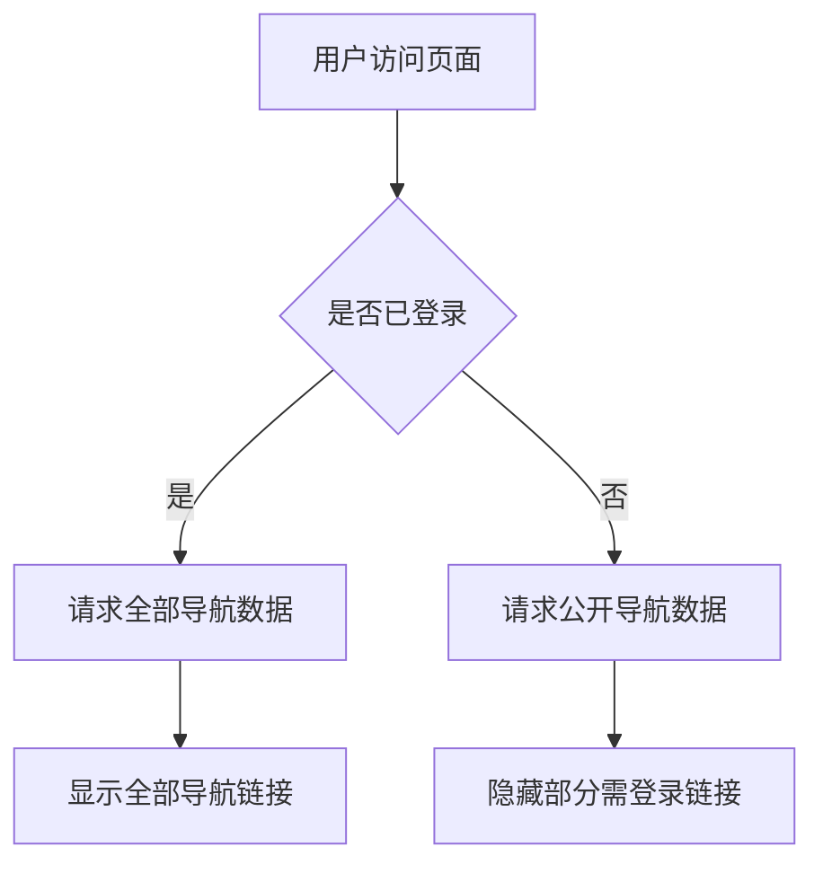

# 导航栏全站项目开发文档

版本：v1.1.0  
最后更新：2024-12-19

---

## 一、项目概述

### 1.1 项目背景

本项目为个人使用的导航栏全站项目，旨在整合常用网站、工具、资源，提升个人效率。页面支持响应式布局，适配PC和移动端。部分导航链接需登录后可见，但大部分内容对未登录用户开放。数据持久化采用 SQLite 数据库，后端提供 API 支持。

### 1.2 技术栈

| 分类     | 技术选型            | 备注                           |
| -------- | ------------------  | ------------------------------ |
| 前端     | HTML5/CSS3/JS       | 原生开发，响应式设计           |
| 样式     | CSS3                | BEM 命名规范，支持移动端       |
| 交互     | 原生JavaScript      | 轻量级，无框架依赖             |
| 后端     | Python + Flask      | 轻量级Web框架，RESTful API     |
| 数据库   | SQLite              | 轻量级嵌入式数据库，支持层级分类 |
| 部署     | 静态+后端服务       | 前端静态文件+后端API服务       |
| 依赖管理 | pip/venv            | Python虚拟环境管理             |

### 1.3 项目当前状态

- ✅ **数据库设计**：已完成表结构设计，支持三层导航结构
- ✅ **数据模型**：基于data.json的实际数据结构优化
- 🔄 **技术选型**：确定使用Flask作为后端框架
- ⏳ **前端开发**：待开始
- ⏳ **后端开发**：待开始
- ⏳ **接口设计**：待开始

---

## 二、开发环境配置

### 2.1 前置依赖

- 工具安装：  
  - Python 3.11+  
  - pip  
  - venv（推荐虚拟环境）  
  - SQLite 3.0+（轻量级数据库）
  - 现代浏览器（如Chrome、Edge、Firefox等）

- 目录结构（示例）：
  ```
  project_root/
    ├─ web/
    │   ├─ index.html
    │   ├─ script.js
    │   ├─ styles.css
    ├─ backend/
    │   ├─ app.py                 # Flask主应用文件
    │   ├─ requirements.txt       # Python依赖列表
    │   ├─ config.py              # 配置文件
    │   ├─ models/                # 数据模型目录
    │   │   ├─ __init__.py
    │   │   ├─ user.py            # 用户模型
    │   │   ├─ category.py        # 分类模型
    │   │   └─ navigation.py      # 导航项模型
    │   ├─ routes/                # 路由处理目录
    │   │   ├─ __init__.py
    │   │   ├─ auth.py            # 认证相关路由
    │   │   ├─ api.py             # API路由
    │   │   └─ navigation.py      # 导航相关路由
    │   ├─ utils/                 # 工具函数目录
    │   │   ├─ __init__.py
    │   │   ├─ database.py        # 数据库连接工具
    │   │   └─ auth.py            # 认证工具
    │   └─ instance/              # 实例文件
    │       └─ app.db             # SQLite数据库文件
    ├─ database/
    │   ├─ 导航系统数据库设计文档.md
    │   └─ init_data.sql
    ├─ data/
    │   └─ data.json              # 原始数据文件
    ├─ docs/
    │   └─ 导航栏前端页面开发文档.md
    └─ README.md
  ```

### 2.2 环境配置步骤

1. **创建项目目录**
   ```bash
   mkdir navigation_project
   cd navigation_project
   ```

2. **创建 Python 虚拟环境**
   
   ```bash
   python -m venv venv
   source venv/bin/activate  # Linux/Mac
   venv\Scripts\activate     # Windows
   ```
   
3. **安装 Python 依赖**
   ```bash
   pip install flask flask-sqlalchemy flask-cors flask-jwt-extended
   pip freeze > requirements.txt
   ```

4. **初始化 Flask 应用**
   ```bash
   # 创建基本目录结构
   mkdir backend backend/models backend/routes backend/utils backend/instance
   
   # 创建数据库文件
   touch backend/instance/app.db
   
   # 运行Flask应用
   cd backend
   python app.py
   ```

### 2.3 启动项目

- 启动 Flask 开发服务器：
  ```bash
  cd backend
  python app.py  # 默认 http://127.0.0.1:5000
  # 或
  flask run --host=0.0.0.0 --port=5000  # 允许外部访问
  ```
- 启动前端：  
  直接用浏览器打开 `web/index.html`。
- 测试API：  
  启动后访问 http://127.0.0.1:5000/api/navs 进行API测试。

---

## 三、代码规范

### 3.1 通用规则

- 文件命名：小写字母+中划线（如 script.js、styles.css）
- 注释：重要逻辑、复杂样式需添加注释说明
- 提交信息：如有版本管理，建议使用简明描述（如 feat: 新增登录功能）

### 3.2 前端规范

- 结构：HTML 结构清晰，语义化标签
- 样式：样式集中在 styles.css，采用BEM风格命名
- 脚本：所有交互逻辑集中在 script.js，函数命名见名知意

### 3.3 后端规范（Flask）

- **应用工厂模式**：使用create_app()创建应用实例
- **蓝图分层**：按功能模块划分蓝图（如auth、api、navigation）
- **REST API**：使用Flask-RESTful或原生路由提供标准化API
- **数据库ORM**：使用Flask-SQLAlchemy进行数据操作
- **配置管理**：使用config.py管理不同环境的配置
- **错误处理**：统一错误处理和响应格式
- **认证授权**：使用Flask-JWT-Extended处理JWT认证

---

## 四、核心功能说明

### 4.1 功能模块清单

| 模块名称   |  依赖接口           |
| ---------- |  ------------------ |
| 登录功能   |POST /api/login    |
| 导航栏     |GET /api/navs      |
| 权限控制   |前端+后端判断      |

### 4.2 关键逻辑流程图



---

## 五、功能与实现说明

### 5.1 登录功能

- 登录入口：页面右上角或指定区域
- 登录方式：前端表单，后端API校验（用户名/密码）
- 登录后：返回JWT token，前端存储（localStorage/sessionStorage），部分导航链接显示
- 未登录：大部分导航可用，部分链接隐藏或不可点击

### 5.2 权限控制

- 前端：根据登录状态显示/隐藏部分导航
- 后端：API根据JWT token判断权限，返回对应数据
- 登录状态保存在本地（如 localStorage/sessionStorage）

### 5.3 导航栏

- 支持多级菜单、下拉菜单
- 响应式布局，移动端自动适配
- 数据来源：后端API（SQLite持久化）

---

## 六、数据库设计（SQLite）

### 6.1 数据库结构概述

项目采用 SQLite 轻量级嵌入式数据库，支持三层导航结构：大分类 -> 子分类 -> 具体网站。

### 6.2 核心表结构

- **users**：用户表，管理用户登录信息
- **nav_categories**：导航分类表，支持多级分类结构
- **navs**：导航项表，存储具体的网站导航信息

### 6.3 关键特性

- 支持层级分类：`parent_id` 字段实现父子关系
- 外键约束：确保数据一致性和完整性
- 灵活排序：`sort_order` 字段支持自定义排序
- 权限控制：`is_public` 字段控制内容可见性

### 6.4 详细设计文档

完整的数据库设计请参考：`database/导航系统数据库设计文档.md`
该文档包含：
- 详细的表结构定义
- ER 关系图
- 完整的 SQL 创建脚本
- 数据操作示例
- 数据库优化建议

---

## 七、样式与交互

- 所有样式集中在 styles.css，支持深色模式和动画
- 主要交互（如菜单展开、tab切换、登录状态切换）由 script.js 实现
- 兼容主流浏览器，移动端适配良好

---

## 八、API 文档（示例）

- 登录
  - `POST /api/login`
  - 请求体：`{ "username": "...", "password": "..." }`
  - 响应：`{ "code": 200, "token": "..." }`
- 获取导航
  - `GET /api/navs`
  - header: `Authorization: Bearer <token>`
  - 响应：`{ "code": 200, "data": [ ... ] }`

---

## 九、测试与部署

### 9.1 测试策略

- 后端：pytest 单元测试
- 前端：手动测试、可选E2E自动化
- 覆盖率建议 ≥ 80%

### 9.2 部署流程

1. **数据库部署**
   - 上传 SQLite 数据库文件（app.db）
   - 或在服务器上执行初始化脚本
   - 设置数据库文件权限

2. **后端服务部署（Flask + Gunicorn）**
   - 安装生产依赖：
     ```bash
     pip install gunicorn
     ```
   - 启动生产服务：
     ```bash
     gunicorn app:app --bind 0.0.0.0:5000 --workers=3
     ```
   - Docker部署示例：
     ```dockerfile
     FROM python:3.9
     WORKDIR /app
     COPY requirements.txt .
     RUN pip install -r requirements.txt
     COPY . .
     CMD ["gunicorn", "app:app", "--bind", "0.0.0.0:5000"]
     ```

3. **前端部署**
   - 静态文件托管（Nginx、Apache 等）
   - 或使用 CDN 服务（如 GitHub Pages）
   - 配置 API 接口地址

   **前端文件结构**：
   ```
   web/
     ├─ index.html
     ├─ script.js
     ├─ styles.css
     └─ ...
   ```

   **配置 API 地址**：
   在 `script.js` 中修改 API 地址：
   ```javascript
   const API_BASE_URL = 'http://your-server-ip:5000';
   ```

   **部署步骤**：
   1. 将 `web/` 目录下的所有文件上传到服务器
   2. 确保后端 API 服务已启动
   3. 修改前端配置文件中的 API 地址
   4. 通过浏览器访问 `index.html`

   **注意事项**：
   - 确保 SQLite 数据库文件（app.db）存在且可访问
   - 检查后端 API 是否正常运行
   - 配置跨域访问（Flask-CORS）
   - 确保Flask的静态文件配置正确

---

## 十、常见问题

Q：为什么有些导航链接看不到？  
A：部分链接仅在登录后可见，登录后自动显示。

Q：如何扩展登录功能？  
A：可对接第三方登录（如OAuth），或增加注册功能。

---

## 十一、备注

- 本项目为个人使用，未涉及复杂用户管理
- 如需扩展，请参考 `项目开发通用模板.md` 相关章节

---

如需进一步细化某一部分（如Flask代码示例、数据库迁移脚本等），请告知！