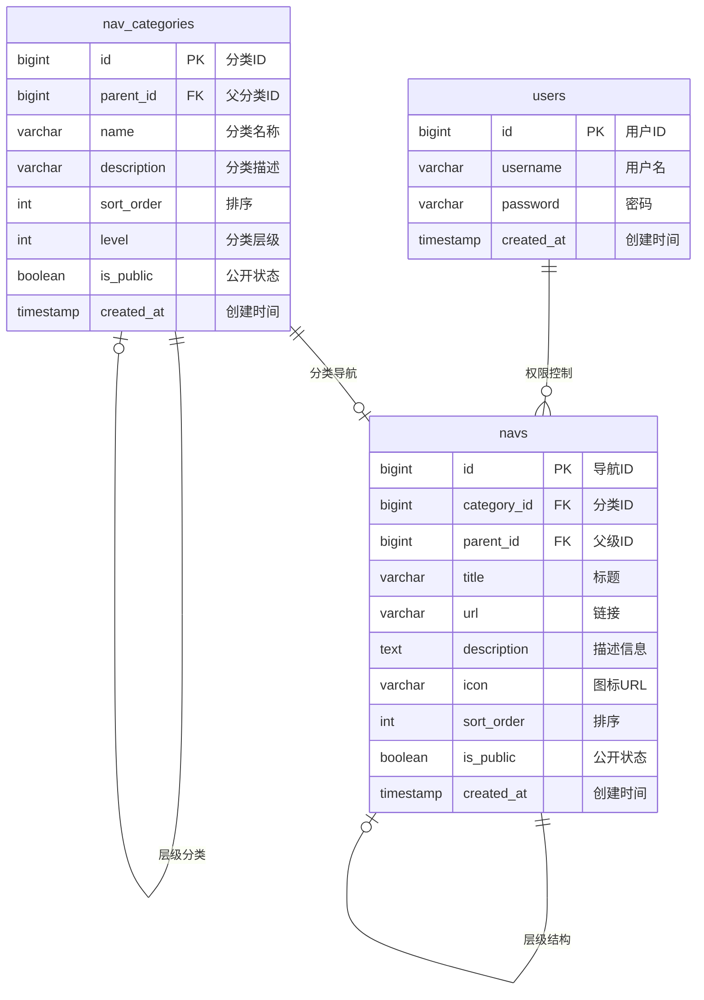

# 导航系统数据库设计文档

版本：v2.1  
最后更新：2025-01-08

---

## 数据库类型：SQLite 3.0+

## 数据库结构概述

本系统包含三个核心表：用户表(users)、导航分类表(nav_categories)和导航菜单表(navs)，实现了用户管理、导航分类和多级菜单功能。



## 表结构详情

### 1. 用户表 (users)

| 字段名     | 类型    | 约束        | 描述             | 示例值                |
| ---------- | ------- | ----------- | ---------------- | --------------------- |
| id         | INTEGER | PRIMARY KEY | 用户唯一标识     | 1                     |
| username   | TEXT    | NOT NULL    | 用户名           | "admin"               |
| password   | TEXT    | NOT NULL    | 密码（加密存储） | "******"              |
| created_at | TEXT    |             | 创建时间         | "2023-08-15 10:00:00" |

### 2. 导航分类表 (nav_categories)

| 字段名      | 类型    | 约束         | 描述                     | 示例值                |
| ----------- | ------- | ------------ | ------------------------ | --------------------- |
| id          | INTEGER | PRIMARY KEY  | 分类唯一标识             | 1                     |
| parent_id   | INTEGER | DEFAULT NULL | 父分类ID（NULL表示顶级） | NULL                  |
| name        | TEXT    | NOT NULL     | 分类名称                 | "编程网站"            |
| description | TEXT    |              | 分类描述                 | "编程相关的网站集合"  |
| sort_order  | INTEGER | DEFAULT 0    | 排序优先级               | 1                     |
| level       | INTEGER | DEFAULT 1    | 分类层级（1=顶级）       | 1                     |
| is_public   | INTEGER | DEFAULT 1    | 是否公开（1=公开）         | 1                     |
| created_at  | TEXT    |              | 创建时间                 | "2023-08-15 10:05:00" |

### 3. 导航菜单表 (navs)

| 字段名      | 类型    | 约束        | 描述                   | 示例值                          |
| ----------- | ------- | ----------- | ---------------------- | --------------------------------- |
| id          | INTEGER | PRIMARY KEY | 导航项唯一标识         | 1                                 |
| category_id | INTEGER | FOREIGN KEY | 所属分类ID             | 1                                 |
| parent_id   | INTEGER | FOREIGN KEY | 父级导航ID             | NULL (顶级菜单)               |
| title       | TEXT    | NOT NULL    | 导航标题               | "Visual Studio Code"              |
| url         | TEXT    | NOT NULL    | 导航链接               | "https://code.visualstudio.com/" |
| description | TEXT    |             | 网站描述信息           | "微软开发的轻量级代码编辑器"      |
| icon        | TEXT    |             | 图标URL地址           | "https://files.codelife.cc/..."  |
| sort_order  | INTEGER | DEFAULT 0   | 排序优先级             | 1                                 |
| is_public   | INTEGER | DEFAULT 1   | 是否公开（1=公开）       | 1                                 |
| created_at  | TEXT    |             | 创建时间               | "2023-08-15 10:10:00"            |

## 完整SQL语句

```sql
-- 创建用户表
CREATE TABLE users (
    id BIGINT AUTO_INCREMENT PRIMARY KEY COMMENT '用户唯一标识',
    username VARCHAR(255) NOT NULL UNIQUE COMMENT '用户名（唯一）',
    password VARCHAR(255) NOT NULL COMMENT '密码（加密存储）',
    created_at TIMESTAMP DEFAULT CURRENT_TIMESTAMP COMMENT '创建时间'
) COMMENT '用户信息表';

-- 创建导航分类表
CREATE TABLE nav_categories (
    id BIGINT AUTO_INCREMENT PRIMARY KEY COMMENT '分类唯一标识',
    parent_id BIGINT DEFAULT NULL COMMENT '父分类ID（NULL表示顶级分类）',
    name VARCHAR(100) NOT NULL COMMENT '分类名称',
    description VARCHAR(500) COMMENT '分类描述',
    sort_order INT NOT NULL DEFAULT 0 COMMENT '排序优先级（数值越小越靠前）',
    level INT NOT NULL DEFAULT 1 COMMENT '分类层级（1=顶级，2=二级）',
    is_public BOOLEAN NOT NULL DEFAULT TRUE COMMENT '是否公开（所有用户可见）',
    created_at TIMESTAMP DEFAULT CURRENT_TIMESTAMP COMMENT '创建时间',
    
    -- 外键约束（允许parent_id为NULL）
    CONSTRAINT fk_categories_parent 
        FOREIGN KEY (parent_id) 
        REFERENCES nav_categories(id) 
        ON DELETE CASCADE,
    
    -- 唯一约束：同级分类名称唯一
    UNIQUE KEY uk_category_name_parent (name, parent_id)
) COMMENT '导航分类表（支持多级分类）';

-- 创建导航菜单表
CREATE TABLE navs (
    id BIGINT AUTO_INCREMENT PRIMARY KEY COMMENT '导航项唯一标识',
    category_id BIGINT NOT NULL COMMENT '所属分类ID',
    parent_id BIGINT DEFAULT NULL COMMENT '父级导航ID（NULL表示顶级）',
    title VARCHAR(100) NOT NULL COMMENT '导航显示名称',
    url VARCHAR(500) NOT NULL COMMENT '导航跳转链接',
    description TEXT COMMENT '网站描述信息',
    icon VARCHAR(500) COMMENT '图标URL地址',
    sort_order INT NOT NULL DEFAULT 0 COMMENT '排序优先级（数值越小越靠前）',
    is_public BOOLEAN NOT NULL DEFAULT TRUE COMMENT '是否公开（所有用户可见）',
    created_at TIMESTAMP DEFAULT CURRENT_TIMESTAMP COMMENT '创建时间',
    
    -- 外键约束
    CONSTRAINT fk_navs_category 
        FOREIGN KEY (category_id) 
        REFERENCES nav_categories(id)
        ON DELETE CASCADE
        ON UPDATE CASCADE,
    
    -- 导航项的层级关系
    CONSTRAINT fk_navs_parent 
        FOREIGN KEY (parent_id) 
        REFERENCES navs(id)
        ON DELETE SET NULL
        ON UPDATE CASCADE
) COMMENT '导航菜单表（支持层级结构）';

-- 个人使用项目，无需角色权限管理表

-- 创建索引优化查询性能
CREATE INDEX idx_users_username ON users(username) COMMENT '用户名索引（用于登录查询）';

CREATE INDEX idx_navs_category ON navs(category_id) COMMENT '分类ID索引（快速按分类查询）';
CREATE INDEX idx_navs_sort ON navs(sort_order) COMMENT '排序索引（菜单排序）';
CREATE INDEX idx_navs_public ON navs(is_public) COMMENT '公开状态索引（用于筛选公开导航项）';

CREATE INDEX idx_categories_parent ON nav_categories(parent_id) COMMENT '父分类索引（构建分类树）';
CREATE INDEX idx_categories_name ON nav_categories(name) COMMENT '分类名称索引';
CREATE INDEX idx_categories_sort ON nav_categories(sort_order) COMMENT '分类排序索引';
CREATE INDEX idx_categories_public ON nav_categories(is_public) COMMENT '公开状态索引';
```


## 外键约束

外键约束已在表创建时定义，无需额外添加。

## 数据操作示例

### 重要说明：外键约束修复

如果你在执行数据插入时遇到外键约束错误，请先执行以下修复操作：

```sql
-- 删除现有表（如果存在数据，请先备份）
DROP TABLE IF EXISTS navs;
DROP TABLE IF EXISTS nav_categories;

-- 重新创建修复后的nav_categories表
CREATE TABLE nav_categories (
    id BIGINT AUTO_INCREMENT PRIMARY KEY COMMENT '分类唯一标识',
    parent_id BIGINT DEFAULT NULL COMMENT '父分类ID（NULL表示顶级分类）',
    name VARCHAR(100) NOT NULL COMMENT '分类名称',
    description VARCHAR(500) COMMENT '分类描述',
    sort_order INT NOT NULL DEFAULT 0 COMMENT '排序优先级（数值越小越靠前）',
    level INT NOT NULL DEFAULT 1 COMMENT '分类层级（1=顶级，2=二级）',
    is_public BOOLEAN NOT NULL DEFAULT TRUE COMMENT '是否公开（所有用户可见）',
    created_at TIMESTAMP DEFAULT CURRENT_TIMESTAMP COMMENT '创建时间',
    
    CONSTRAINT fk_categories_parent 
        FOREIGN KEY (parent_id) 
        REFERENCES nav_categories(id) 
        ON DELETE CASCADE,
    
    UNIQUE KEY uk_category_name_parent (name, parent_id)
) COMMENT '导航分类表（支持多级分类）';

-- 重新创建修复后的navs表
CREATE TABLE navs (
    id BIGINT AUTO_INCREMENT PRIMARY KEY COMMENT '导航项唯一标识',
    category_id BIGINT NOT NULL COMMENT '所属分类ID',
    parent_id BIGINT DEFAULT NULL COMMENT '父级导航ID（NULL表示顶级）',
    title VARCHAR(100) NOT NULL COMMENT '导航显示名称',
    url VARCHAR(500) NOT NULL COMMENT '导航跳转链接',
    description TEXT COMMENT '网站描述信息',
    icon VARCHAR(500) COMMENT '图标URL地址',
    sort_order INT NOT NULL DEFAULT 0 COMMENT '排序优先级（数值越小越靠前）',
    is_public BOOLEAN NOT NULL DEFAULT TRUE COMMENT '是否公开（所有用户可见）',
    created_at TIMESTAMP DEFAULT CURRENT_TIMESTAMP COMMENT '创建时间',
    
    CONSTRAINT fk_navs_category 
        FOREIGN KEY (category_id) 
        REFERENCES nav_categories(id)
        ON DELETE CASCADE
        ON UPDATE CASCADE,
    
    CONSTRAINT fk_navs_parent 
        FOREIGN KEY (parent_id) 
        REFERENCES navs(id)
        ON DELETE SET NULL
        ON UPDATE CASCADE
) COMMENT '导航菜单表（支持层级结构）';

-- 创建索引
CREATE INDEX idx_navs_category ON navs(category_id);
CREATE INDEX idx_navs_sort ON navs(sort_order);
CREATE INDEX idx_categories_parent ON nav_categories(parent_id);
CREATE INDEX idx_categories_sort ON nav_categories(sort_order);
```

### 1. 创建导航分类

根据data.json数据结构，创建多级分类体系：

```sql
-- 插入一级分类（大分类）
INSERT INTO nav_categories (name, parent_id, description, sort_order, level, is_public) VALUES
('编程网站', NULL, '编程相关的网站集合', 1, 1, TRUE),
('工具网站', NULL, '各类实用工具网站', 2, 1, TRUE);

-- 获取一级分类ID
SET @programming_id = (SELECT id FROM nav_categories WHERE name = '编程网站' AND parent_id IS NULL);
SET @tools_id = (SELECT id FROM nav_categories WHERE name = '工具网站' AND parent_id IS NULL);

-- 插入二级分类（子分类）
INSERT INTO nav_categories (name, parent_id, description, sort_order, level, is_public) VALUES
-- 编程网站下的子分类
('编码工具', @programming_id, '编码和开发工具', 1, 2, TRUE),
('后端', @programming_id, '后端开发资源', 2, 2, TRUE),
('前端', @programming_id, '前端开发资源', 3, 2, TRUE),
-- 工具网站下的子分类
('PDF转换', @tools_id, 'PDF文件处理工具', 1, 2, TRUE),
('图片处理', @tools_id, '在线图片编辑工具', 2, 2, TRUE);
```

### 2. 添加导航菜单项

根据data.json中的具体数据，添加导航项示例：

```sql
-- 获取分类ID用于插入
SET @coding_tools_id = (SELECT id FROM nav_categories WHERE name = '编码工具');
SET @backend_id = (SELECT id FROM nav_categories WHERE name = '后端');
SET @frontend_id = (SELECT id FROM nav_categories WHERE name = '前端');
SET @pdf_tools_id = (SELECT id FROM nav_categories WHERE name = 'PDF转换');

-- 编码工具分类下的导航项
INSERT INTO navs (category_id, title, url, description, icon, sort_order) VALUES
(@coding_tools_id, 'Visual Studio Code', 'https://code.visualstudio.com/', '微软开发的轻量级代码编辑器', 'https://files.codelife.cc/website/visual-studio-code.svg', 1),
(@coding_tools_id, 'GitHub', 'https://github.com/', '全球最大的代码托管平台', 'https://files.codelife.cc/website/github.svg', 2),
(@coding_tools_id, 'Gitee', 'https://gitee.com/', '中国本土的代码托管平台', 'https://files.codelife.cc/website/gitee.svg', 3),
(@coding_tools_id, 'MarsCode', 'https://marscode.com.cn/', '豆包旗下的智能编程工具', 'https://lf-cdn.marscode.com.cn/obj/marscode-cn-release/marscode-icon.png', 4),
(@coding_tools_id, 'CodePen', 'https://codepen.io/', '前端代码在线编辑器', 'https://files.codelife.cc/website/codepen.svg', 5),
(@coding_tools_id, 'JSFiddle', 'https://jsfiddle.net/', '在线JavaScript代码测试工具', 'https://files.codelife.cc/website/jsfiddle.png', 6),
(@coding_tools_id, 'StackBlitz', 'https://stackblitz.com/', '在线IDE，支持多种框架', 'https://files.codelife.cc/website/stackblitz.svg', 7),
(@coding_tools_id, 'GitLab', 'https://gitlab.com/', '开源的代码托管平台', 'https://files.codelife.cc/website/gitlab.svg', 8),
(@coding_tools_id, 'Bitbucket', 'https://bitbucket.org/', 'Atlassian旗下的代码托管平台', 'https://files.codelife.cc/website/bitbucket.svg', 9),
(@coding_tools_id, 'Docker', 'https://www.docker.com/', '容器化平台', 'https://files.codelife.cc/website/docker.svg', 10);

-- 后端分类下的导航项（7个）
INSERT INTO navs (category_id, title, url, description, icon, sort_order) VALUES
(@backend_id, 'MyBatis', 'https://mybatis.org/mybatis-3/', 'Java持久层框架', 'https://files.codelife.cc/user-website-icon/20220803/J_G1ipNrekOYJSmTCACZ99269.png', 1),
(@backend_id, 'Spring', 'https://spring.io/', 'Java企业级开发框架', 'https://files.codelife.cc/website/5b307dd14c14a60c5612d29d.png', 2),
(@backend_id, 'MySQL', 'https://dev.mysql.com/', '开源关系型数据库', 'https://files.codelife.cc/website/5f4386f4aa121b0c2ac69e22.png', 3),
(@backend_id, 'Maven', 'https://maven.apache.org/', 'Java项目管理工具', 'https://files.codelife.cc/website/5b3110634c14a60c5612d3e1.png', 4),
(@backend_id, 'Redis', 'https://redis.io/', '内存数据结构存储', 'https://files.codelife.cc/website/redis.svg', 5),
(@backend_id, 'MongoDB', 'https://www.mongodb.com/', '文档型数据库', 'https://files.codelife.cc/website/mongodb.svg', 6),
(@backend_id, 'PostgreSQL', 'https://www.postgresql.org/', '高级开源关系型数据库', 'https://files.codelife.cc/website/postgresql.svg', 7);

-- 前端分类下的导航项（5个）
INSERT INTO navs (category_id, title, url, description, icon, sort_order) VALUES
(@frontend_id, 'React', 'https://react.dev/', '用于构建用户界面的JavaScript库', 'https://files.codelife.cc/website/react.svg', 1),
(@frontend_id, 'Vue.js', 'https://vuejs.org/', '渐进式JavaScript框架', 'https://files.codelife.cc/website/vue.svg', 2),
(@frontend_id, 'TypeScript', 'https://www.typescriptlang.org/', 'JavaScript的超集，添加了类型系统', 'https://files.codelife.cc/website/typescript.svg', 3),
(@frontend_id, 'Figma', 'https://www.figma.com/', '协作式设计工具', 'https://files.codelife.cc/website/figma.svg', 4),
(@frontend_id, 'Canva可画', 'https://www.canva.cn/', '在线设计工具平台', 'https://files.codelife.cc/website/canva.svg', 5);

-- 添加测试用户
INSERT INTO users (username, password) VALUES
('admin', '$2a$10$N.zmdr9k7uOCQb376NoUnuTJ8iAt6Z5EHsM8lE9lBOsl7iOEfeVdi'),
('user1', '$2a$10$N.zmdr9k7uOCQb376NoUnuTJ8iAt6Z5EHsM8lE9lBOsl7iOEfeVdi'),
('guest', '$2a$10$N.zmdr9k7uOCQb376NoUnuTJ8iAt6Z5EHsM8lE9lBOsl7iOEfeVdi');

```

## 查询示例

### 1. 获取所有顶级分类

```sql
SELECT * FROM nav_categories 
WHERE parent_id IS NULL 
ORDER BY sort_order;
```

### 2. 获取指定分类下的所有子分类

```sql
SELECT * FROM nav_categories 
WHERE parent_id = 1 
ORDER BY sort_order;
```

### 3. 获取指定分类下的所有导航项

```sql
SELECT n.*, c.name as category_name 
FROM navs n 
JOIN nav_categories c ON n.category_id = c.id 
WHERE n.category_id = 3 
ORDER BY n.sort_order;
```

### 4. 获取完整的导航树结构

```sql
-- 获取所有分类和导航项（分层查询）
SELECT 
    c1.id as level1_id,
    c1.name as level1_name,
    c2.id as level2_id,
    c2.name as level2_name,
    n.id as nav_id,
    n.title as nav_title,
    n.url as nav_url,
    n.description as nav_description,
    n.icon as nav_icon
FROM nav_categories c1
LEFT JOIN nav_categories c2 ON c2.parent_id = c1.id
LEFT JOIN navs n ON n.category_id = c2.id
WHERE c1.parent_id IS NULL
ORDER BY c1.sort_order, c2.sort_order, n.sort_order;
```

### 5. 搜索导航项

```sql
-- 按标题搜索
SELECT n.*, c.name as category_name 
FROM navs n 
JOIN nav_categories c ON n.category_id = c.id 
WHERE n.title LIKE '%GitHub%' 
ORDER BY n.sort_order;

-- 获取顶级分类列表
SELECT 
    id,
    name,
    description,
    sort_order
FROM nav_categories
WHERE parent_id = 1 AND is_public = TRUE
ORDER BY sort_order;

-- 获取某个顶级分类下的所有子分类及其导航项数量
SELECT 
    c.id,
    c.name,
    c.description,
    c.sort_order,
    COUNT(n.id) AS nav_count
FROM nav_categories c
LEFT JOIN navs n ON c.id = n.category_id AND n.is_public = TRUE
WHERE c.parent_id = @programming_id AND c.is_public = TRUE
GROUP BY c.id, c.name, c.description, c.sort_order
ORDER BY c.sort_order;
```

## 数据库维护

### 1. 备份数据库

```bash
mysqldump -u username -p database_name > navigation_backup.sql
```

### 2. 恢复数据库

```bash
mysql -u username -p database_name < navigation_backup.sql
```

### 3. 清理无用数据

```sql
-- 删除无效的导航项（URL为空或无效）
DELETE FROM navs WHERE url IS NULL OR url = '';

-- 删除空的分类（没有子分类和导航项）
DELETE FROM nav_categories 
WHERE id NOT IN (
    SELECT DISTINCT parent_id FROM nav_categories WHERE parent_id IS NOT NULL
    UNION 
    SELECT DISTINCT category_id FROM navs
) AND parent_id IS NOT NULL;
```

## 优化总结

### 1. 修复SQL语法错误
- **问题**：navs表创建时外键约束语法错误（MySQL 1064错误）
- **解决**：移除了FOREIGN KEY后的COMMENT语句，确保语法正确

### 2. 表结构优化
基于data.json实际数据结构，进行了以下优化：

#### 导航分类表优化

- **新增**：`parent_id`字段支持多级分类，使用0代替NULL表示顶级分类
- **新增**：虚拟根节点确保分类树结构完整
- **新增**：显式命名的外键约束`fk_categories_parent`
- **调整**：`name`字段改为非唯一，通过复合唯一约束`uk_category_name_parent`确保同级分类名称唯一
- **调整**：统一级联删除策略为ON DELETE CASCADE
- **修复**：唯一约束在NULL值时的失效问题
- **新增**：`idx_categories_parent`索引优化分类树查询

#### 导航菜单表优化
- **新增**：`description`字段存储网站详细描述
- **调整**：`icon`字段扩展至500字符，支持完整URL图标地址
- **调整**：`url`字段设为NOT NULL，确保数据完整性
- **移除**：`parent_id`字段（导航项不再支持子菜单，简化设计）
- **新增**：显式命名的外键约束`fk_navs_category`

### 3. 简化设计（个人使用）
- **移除**：角色权限管理表（role_category_permissions、role_nav_permissions）
- **移除**：角色权限相关的索引
- **简化**：数据库结构，专注于导航功能本身

### 4. 数据设计
- **虚拟根节点**：1个（根节点）
- **顶级分类**：1个（编程网站）
- **子分类**：3个（编码工具、后端、前端）
- **导航项**：20个真实数据
  - 编码工具：8个（VS Code、GitHub、Gitee等）
  - 后端技术：7个（MyBatis、Spring、MySQL等）
  - 前端技术：5个（React、Vue.js、TypeScript等）
- **测试用户**：3个（含加密密码）

### 5. 查询优化
- 提供完整的分类树查询示例
- 支持按分类筛选导航项
- 优化索引设计，提升查询性能

### 6. 技术规范
- 所有外键约束均使用显式命名
- 统一级联删除策略确保数据一致性
- 保持MySQL兼容性
- 支持事务完整性
- 预留权限管理扩展接口

该优化后的设计完全基于data.json数据结构，支持真实的业务场景，具有良好的扩展性和查询性能。